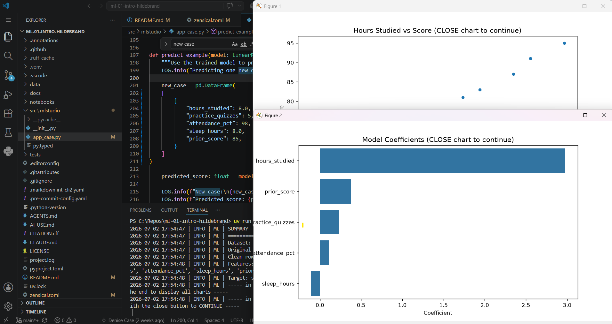

# Project Documentation

This site provides project documentation.
Use the documentation navigation to explore.

## How-To Guide

Many instructions are common to all our projects.

See
[⭐ **Workflow: Apply Example**](https://denisecase.github.io/pro-analytics-02/workflow-b-apply-example-project/)
to get the example projects running on your machine.

## Project Documentation Pages (docs/)

- **Home** - this documentation landing page
- [**Project Instructions**](./project-instructions.md)  - the standard project workflow
- [**Your Files**](./your-files.md) - how to copy the example and create your version
- [**Glossary**](./glossary.md) - project terms and concepts
- [**API**](./api.md) - autogenerated code documentation for the public project interface

---

## Phase 4. Technical Modification

For my technical modification, I updated the values used for the example student in the prediction section of the application (`predict_example()` in `app_case.py`).

### What I Changed

I changed the example student's information from:

- Hours studied: 6.5 → 8.0
- Practice quizzes: 4 → 5
- Attendance: 92% → 98%
- Sleep hours: 7.0 → 8.0
- Prior score: 72 → 85

### Why I Chose This Change

I wanted to make a small, safe modification that would demonstrate how changing the input features affects the machine learning model's prediction without changing the overall program.

### How I Verified It Worked

After saving the changes, I reran the application using:

```text
uv run python -m mlstudio.app_case
```

The program completed successfully, displayed the charts, and generated a new prediction.

### Results

Before my modification, the predicted score was:

**83.4**

After my modification, the predicted score increased to:

**93.6**

This demonstrated that the model responded appropriately to stronger student performance inputs.

### Reflection

This modification was straightforward because the project was already working correctly. It helped me better understand how machine learning models use feature values to make predictions and how small code changes can affect model output.

---

# Phase 5. Custom Project (Module 1)

## Basis and Data

For Module 1, I continued using the example student performance dataset included with the project. The dataset contains information such as hours studied, attendance, practice quizzes, sleep hours, prior score, and final score.

This dataset is appropriate for learning because it is small, easy to understand, and demonstrates a complete machine learning workflow.

## Modeling Approach

This project uses **supervised machine learning** because the dataset contains a known target variable (`score`) that the model predicts using several input features.

Because the target is a continuous numeric value, this is a **regression** problem.

## Summary

Although Phase 5 is optional in Module 1, I continued exploring the example project by modifying the prediction inputs and observing how the model responded.

Working through this project helped me better understand:

- setting up a professional Python project
- running machine learning workflows
- reading project documentation
- making small code modifications
- interpreting prediction results

In future projects I could apply these same skills to larger datasets such as housing prices, medical predictions, customer purchasing behavior, or student performance data.


